## **Langkah langkah instalasi github di Windows**

1. Setelah download Git, double click pada file yang di-download. Akan dimunculkan lisensi. Klik **Next** untuk lanjut.

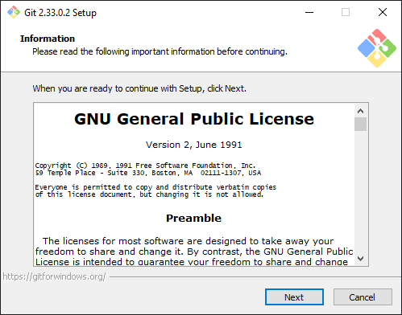

2. Setelah itu, pilih lokasi instalasi. Secara default akan terisi C:\Program Files\Git. lokasi instalasi dapat diganti sesuai keinginan. Kemudian klik **Next**.

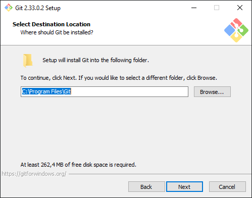

3. Pilih Komponen. 

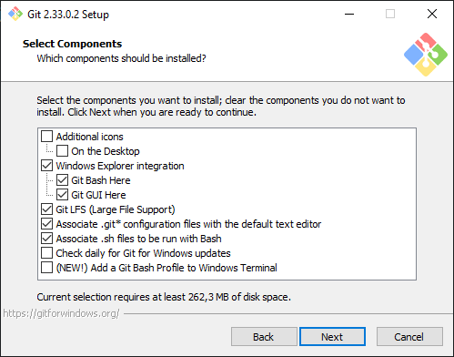

4. Mengisi shortcut untuk menu Start.

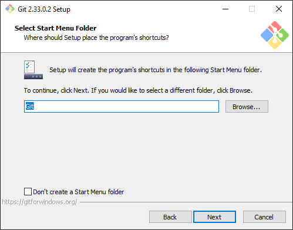

5.  Pilih Editor yang akan digunakan bersama Git. disini memilih untuk menggunakan VSCode. 

6. Pada saat instalasi, Git menyediakan akses git melalui Bash maupun command prompt. pilih pilihan kedua supaya dapat menggunakan dari dua antarmuka tersebut. Bash adalah shell di Linux. Dengan menggunakan bash di Windows, pekerjaan di command line Windows bisa dilakukan menggunakan bash - termasuk ekskusi dari Git.

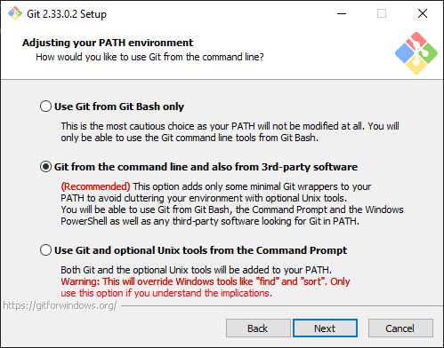

7. Pilih OpenSSL untuk HTTPS.

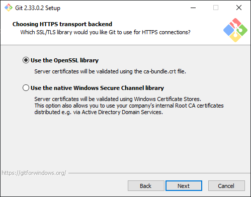

8. Pilih pilihan pertama untuk konversi akhir baris (CR-LF).

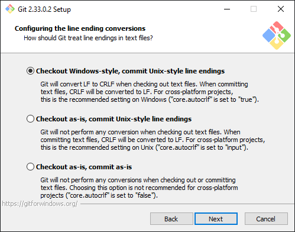

9. Pilih MinTTY untuk terminal yang digunakan untuk mengakses Git Bash.

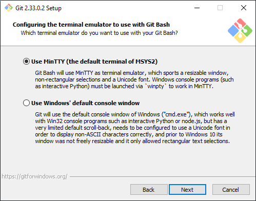

10. Pilih Credential Manager Core

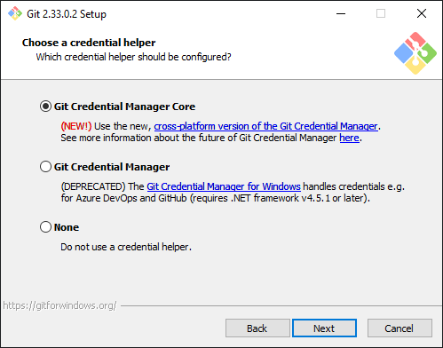

11. Untuk opsi ekstra, aktifkan opsi pertama.

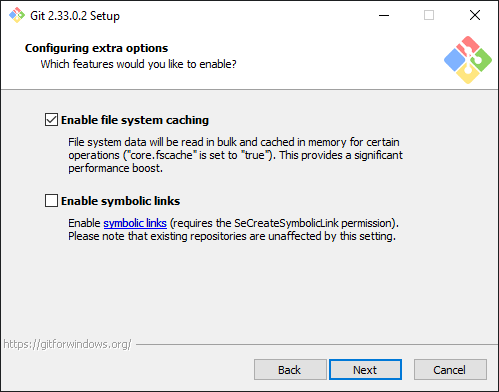

12. Setelah itu proses instalasi akan dilakukan.

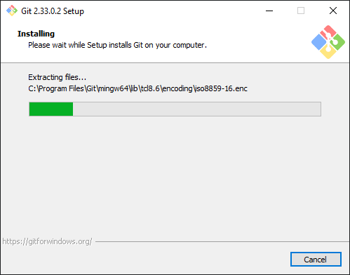

13. Jika selesai akan muncul dialog pemberitahuan. Klik pada Finish.

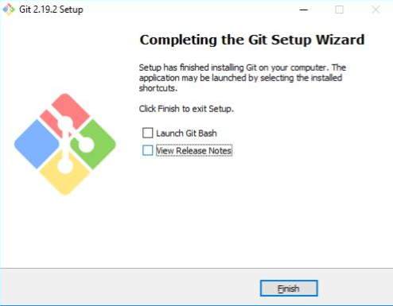

14. Untuk menjalankan, dari Start menu, ketikkan "Git", akan muncul beberapa pilihan. Pilih "Git Bash" atau "Git GUI".

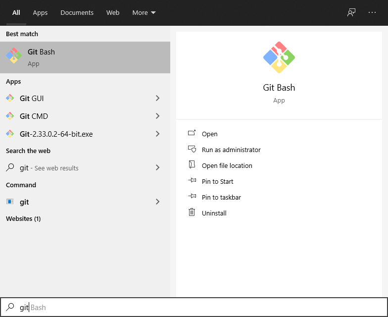

15. Untuk mencoba dari command prompt, masuk ke command prompt, setelah itu eksekusi "git --version" untuk melihat apakah sudah terinstall atau belum. Jika sudah terinstall dengan benar, makan akan muncul hasil berikut:

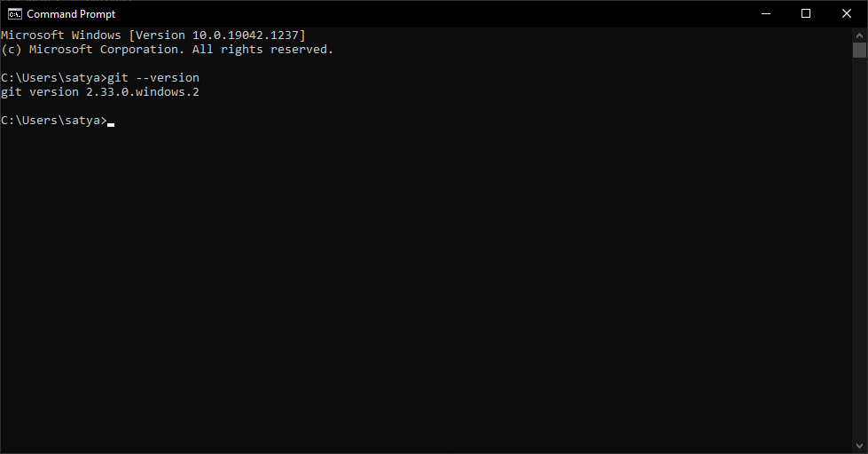