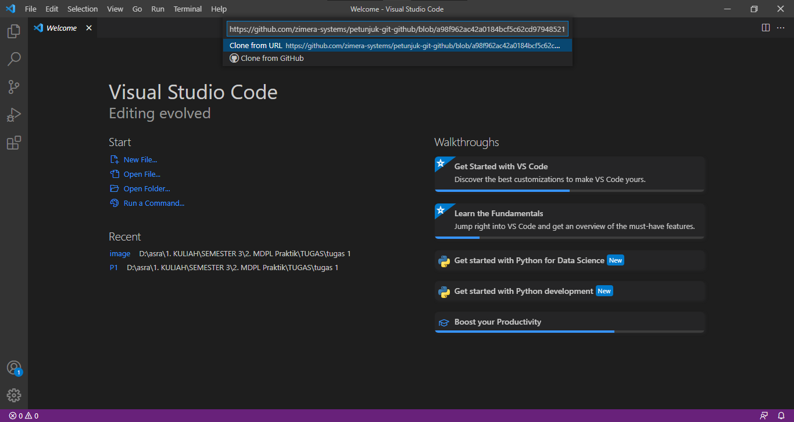

## **Membuat Repo**

untuk membuat repo, gunakan langkah berikut :

1. Klik tanda + pada bagian atas setelah login, pilih **New Repository**

2. Isikan nama, keterangan, serta lisensi. Jika dikehendaki, bisa membuat repo Private

3. Klik `Create Repository`

Setelah langkah-langkah tersebut, repo akan dibuat dan bisa diakses menggunakan pola `https://github.com/username/reponame.`

## **Clone Repository**

Proses clone adalah proses untuk menduplikasikan remote repo di GitHub ke komputer lokal. Untuk melakukan proses clone, gunakan perintah berikut:

1. buka repository yang akan di clone
2. kemudian klik code dan salin link repository tersebut

3. Kemudian menuju ke VSCode. Klik *View* kemudian klik *Command Palette*

4. kemudian ketikan `clone` pada kotak yang tersedia.

5. Setelah itu masukan URLnya dan tekan Enter.

6. Lalu tentukan Folder yang di gunakan untuk meletakan file tersebut. lalu klik `Select Repository Location`. Setelah itu tinggal menunggu proses *clone* selesai

